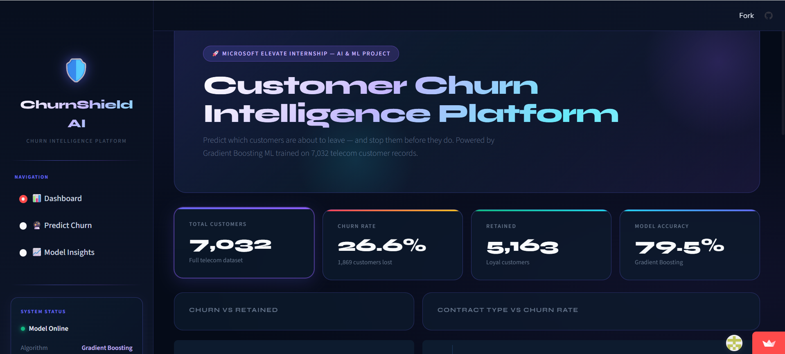
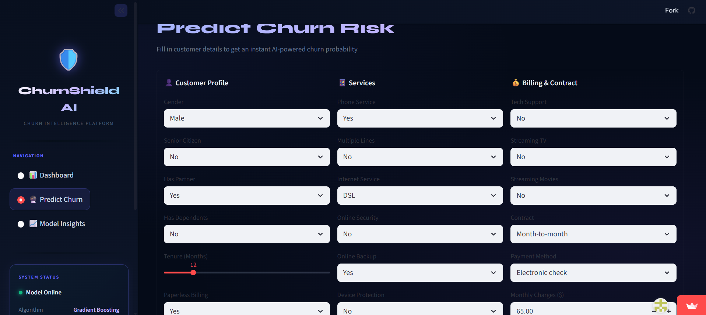
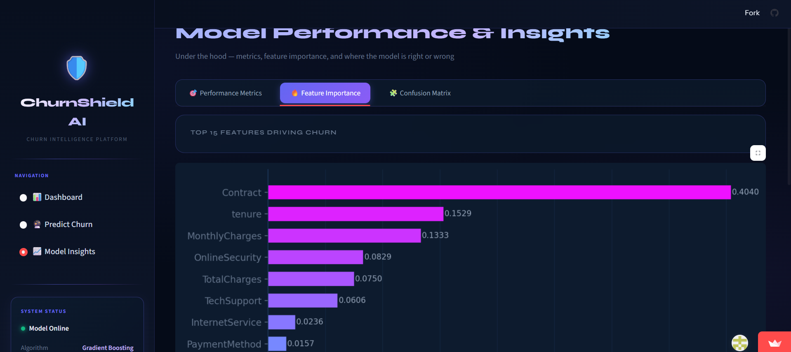

# 🛡️ ChurnShield AI — Customer Churn Prediction Platform

<div align="center">


[](https://python.org)
[](https://streamlit.io)
[](https://scikit-learn.org)
[](https://pandas.pydata.org)
[](LICENSE)

**Predict which telecom customers will leave — before they do.**
An end-to-end Machine Learning project with a premium interactive dashboard.

[🚀 Live Demo](#-live-demo) · [📊 Features](#-features) · [🧠 How It Works](#-how-it-works) · [⚙️ Installation](#️-installation) · [📁 Project Structure](#-project-structure)

</div>

---

## 👨‍💻 Author

**Dilli Prasanna Bandi**
Microsoft Elevate Internship — AI & ML Capstone Project 2026

[](https://github.com/DilliPrasanna2244)
[](https://linkedin.com/in/dilliprasannabandi)

---

## 📌 What is Customer Churn?

> **Churn** = A customer cancelling their subscription and switching to a competitor.

Imagine you're using **Airtel** and you switch to **Jio** — you just **churned** from Airtel's perspective. Every company loses revenue when customers leave, and acquiring a new customer costs **5x more** than retaining an existing one.

```
Without ML:  Company loses customer → Realizes → Too late ❌
With ML:     Model flags at-risk customer → Company acts → Customer stays ✅
```

---

## 🎯 Project Overview

| Property | Details |
|---|---|
| 🏫 **Project Type** | Microsoft Elevate Internship Capstone |
| 👨‍💻 **Author** | Dilli Prasanna Bandi |
| 🎯 **Problem** | Binary Classification — Will a customer churn? (Yes/No) |
| 📊 **Dataset** | IBM Telco Customer Churn — 7,032 customers, 20 features |
| 🤖 **Best Model** | Gradient Boosting Classifier |
| 📈 **Accuracy** | 79.5% |
| 🌐 **Deployment** | Streamlit Cloud (Live Web App) |
| 💻 **Tech Stack** | Python, Scikit-Learn, Pandas, Matplotlib, Seaborn, Streamlit |

---

## 📸 Screenshots

### 📊 Dashboard — Live KPI Cards & Charts


### 🔮 Predict Churn — Instant AI Prediction


### 📈 Model Insights — Performance & Feature Importance


---

## ✨ Features

### 📊 Dashboard Page
- Live KPI cards — Total customers, Churn rate, Retained count, Model accuracy
- Donut chart — Churned vs Retained split
- Bar chart — Churn rate by Contract type
- Histogram — Monthly charges distribution (Churned vs Retained)
- Box plot — Tenure comparison between churned and retained customers
- Business insight cards with key statistics

### 🔮 Predict Churn Page
- Interactive form — Enter any customer's 19 features
- Instant prediction — High Risk ⚠️ or Low Risk ✅
- Probability meter — Shows exact churn probability %
- Smart retention recommendations — Personalized tips based on inputs

### 📈 Model Insights Page
- Performance metrics — Accuracy, Precision, Recall, F1-Score
- Algorithm comparison chart — All 3 models side by side
- Feature importance chart — Top 10 factors that drive churn
- Confusion matrix — Visual breakdown of TP, TN, FP, FN

---

## 🧠 How It Works

```
Raw CSV Data → Data Cleaning → EDA → Encoding → Scaling → Model Training → Evaluation → Streamlit App
```

---

## 📊 Model Performance

| Model | Accuracy | Precision | Recall | F1-Score |
|---|---|---|---|---|
| Logistic Regression | 78.54% | 62% | 49% | 55% |
| Random Forest | 79.03% | 64% | 48% | 55% |
| **Gradient Boosting ★** | **79.53%** | **65%** | **49%** | **56%** |

---

## 🔑 Key Business Insights

```
📌 Month-to-month customers churn at 42% — highest risk group
📌 Two-year contract customers churn at only 3% — most loyal
📌 Average tenure of churned customers: ~10 months vs ~37 months retained
📌 Churned customers pay ~$74/month vs $61 for retained customers
📌 Electronic check payment users churn more than auto-pay users
```

---

## ⚙️ Installation

```bash
# Clone repo
git clone https://github.com/DilliPrasanna2244/customer-churn-prediction.git
cd customer-churn-prediction

# Create virtual environment
python -m venv venv
venv\Scripts\activate        # Windows
source venv/bin/activate     # Mac/Linux

# Install dependencies
pip install -r requirements.txt

# Run ML pipeline
python main.py

# Launch web app
streamlit run app.py
```

---

## 📁 Project Structure

```
customer-churn-prediction/
├── 📂 data/                  ← Raw dataset
├── 📂 notebooks/             ← Jupyter experiments
├── 📂 src/                   ← Source code modules
│   ├── data_preprocessing.py
│   ├── eda.py
│   ├── model.py
│   └── predict.py
├── 📂 outputs/               ← Saved charts and model
├── 📂 screenshots/           ← App screenshots
├── 🐍 app.py                 ← Streamlit web app
├── 🐍 main.py                ← ML pipeline runner
└── 📄 requirements.txt       ← Dependencies
```

---

## 🌐 Live Demo

> 🔗 **[Click here to open the live app](https://customer-churn-prediction-microsoft-internship-project.streamlit.app/)**

---

## 📚 Libraries Used

| Library | Purpose |
|---|---|
| `pandas` | Data loading and manipulation |
| `numpy` | Numerical operations |
| `matplotlib` | Chart creation |
| `seaborn` | Statistical visualizations |
| `scikit-learn` | ML models, preprocessing, metrics |
| `joblib` | Save and load trained models |
| `streamlit` | Convert Python into a web app |

---

## 💬 Interview Q&A

<details>
<summary><b>Q: Why did you choose Gradient Boosting?</b></summary>
Gradient Boosting builds decision trees sequentially — each tree corrects the errors of the previous one. It outperformed Logistic Regression (too simple) and Random Forest (trees don't learn from each other). GB gave best accuracy at 79.53%.
</details>

<details>
<summary><b>Q: What is data leakage and how did you prevent it?</b></summary>
Data leakage is when test data leaks into training, making accuracy look artificially high. I prevented it by fitting StandardScaler only on training data and only transforming test data.
</details>

<details>
<summary><b>Q: Why is Recall more important than Precision here?</b></summary>
A False Negative (missing an actual churner) costs more than a False Positive. Missing a churner = permanent revenue loss. A false alarm = just an unnecessary retention call.
</details>

<details>
<summary><b>Q: What is the business value?</b></summary>
Companies can proactively identify at-risk customers and offer discounts before they leave. Retaining a customer costs 5x less than acquiring a new one.
</details>

---

## 📄 License

MIT License — feel free to use and modify.

---

## 📎 Project Presentation

[📥 Download Project PPT](MS_Elevate_ChurnShield_Final.pptx)


<div align="center">


⭐ **If this helped you, please give it a star!** ⭐

**Built with ❤️ by [Dilli Prasanna Bandi](https://github.com/DilliPrasanna2244)**

</div>
